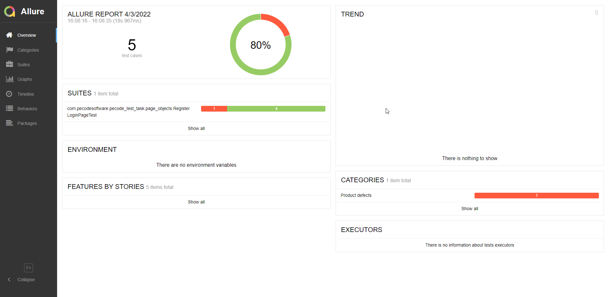
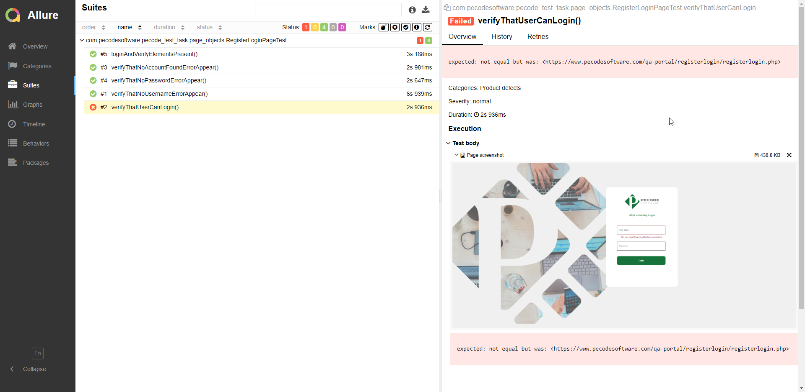

## Automation QA Test Task(Java)

1 Write an automation script using Selenium WebDriver and Maven with Java as the language which will open: https://www.pecodesoftware.com/qa-portal/greet.php page

2 Create an environment file and pick up all the credentials values from there.

3 Fill in the “Username” and “Password” input fields and click the “Signup” button.

4 Use an assertion library and verify that all the elements are present on the page.

5 Verify that all the error messages appear.

6 Create a test-case that will fail because of unsuccessful login.

7 Use a page-object pattern

8 The result of execution should generate:
        1) A report file.
        2) Screenshots for failing the test.

9 Post the code to public Github repository and provide a link. 

# Reports
Reports generate in allure-results folder as result.json files

## To see full report need to:

### 1)Install [Allure commandline](https://docs.qameta.io/allure/)
### 2) use command `allure serve .\allure-results` in terminal

#### Generated report:

